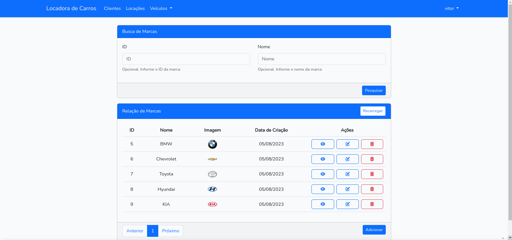

<h1><a href="https://github.com/vitorcosta42/app_locadora_carros/tree/master">Locadora de Carros - Vitor Costa </a></h1>

   
   
    
  
    

<h2>Descrição</h2>

  Projeto Full-Stack utilizando Vue.js e Bootstrap para o Front-end, e PHP, Laravel e MySQL para o back-end. Temos autenticação, validação, criação, edição, listagem e remoção de carros, locações, clientes, modelos e marcas de carros! Um projeto muito completo e com várias features que mostram um pouco do meu lado full-stack, espero que gostem.

<h2>Como utilizar</h2>

<h3>1. Clone o repositório:</h3>
<pre>
  <code>
    git clone https://github.com/vitorcosta42/app_locadora_carros.git
  </code>
</pre>

<h3>2. Entre no repositório clonado e instale as dependências:</h3>
<pre>
  <code>
    npm install
  </code>
</pre>
<pre>
  <code>
    composer install
  </code>
</pre>

<h3>3. Inicie o servidor Vue e o servidor Laravel</h3>
<pre>
  <code>
    npm run dev
  </code>
</pre>
<pre>
  <code>
     php artisan serve
  </code>
</pre>
<h5> **É importante se lembrar de configurar o seu banco de dados local no arquivo .env antes das migrações** </h5> 
<h3>4. Faça as migrações</h3>
<pre>
  <code>
   php artisan migrate     
  </code>
</pre>
<h3>5. Faça a conexão das storages</h3>
<pre>
  <code>
   php artisan storage:link
  </code>
</pre>
<h3>6. Crie um token JWT para a autenticação</h3>
<pre>
  <code>
   php artisan jwt:secret
  </code>
</pre>
<h6>Após realizar esta sequência de passos a aplicação já estará pronta para ser utilizada! </h6>

<h2>Créditos</h2>
<table>
  <tr>
    <td align="center">
      <a href="https://github.com/vitorcosta42">
         
        
          <b>Vitor Costa</b>
        
      </a>
    </td>
  </tr>
</table>

<h2>Licença</h2>
<b>All Rights Reserved</b>
